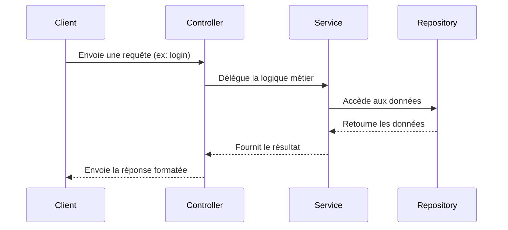

# Endpoint

Cette partie décrit **comment créer un endpoint** dans le projet en respectant l’architecture **Clean Architecture** et les bonnes pratiques.

Nous prendrons l'exemple de **l'endpoint `auth/login`** pour illustrer chaque étape.

---

# 🔖 Table des matières

- [1. Mise en place du DTO](#dto)
- [2. Mise en place du Controller](#controller)
- [3. Mise en place du Service](#service)
- [4. Mise en place du Repository](#repository)
- [5. Entité et Base de Données](#entity)

---

## 1. Mise en place du DTO {#dto}

Le DTO (Data Transfer Object) est utilisé pour :

- Définir précisément la structure des données échangées
- Documenter automatiquement les API avec Swagger (`@ApiProperty`)
- Effectuer des validations automatiques

Les DTO sont essentiels pour garantir que les données reçues par le Controller sont correctement typées et validées.

👉 Voir [dto.md](/docs/backend/dto.md) pour plus de détails.

---

## 2. Mise en place du Controller {#controller}

Le Controller reçoit les requêtes HTTP et délègue au Service.

Caractéristiques du Controller :

- Il **étend `AbstractController`** pour uniformiser la gestion des réponses et des erreurs
- Les services sont injectés via le `constructor` pour respecter l'inversion de dépendances
- Il **ne contient pas** de logique métier
- Il utilise les DTO en entrée/sortie

👉 Voir [controller.md](/docs/backend/controller.md) pour plus de détails.

---

## 3. Mise en place du Service {#service}

Le Service est responsable de la **logique métier**.

Un Service :

- Implémente une interface (exemple : `IAuthService`)
- Est indépendant de l'infrastructure (base de données, HTTP, etc.)
- Peut être facilement testé en isolation

👉 Voir [service.md](/docs/backend/service.md) pour plus de détails.

---

## 4. Mise en place du Repository {#repository}

Le Repository gère la communication avec la base de données.

Il doit :

- Implémenter une interface
- Ne contenir **que** des accès aux données (pas de logique métier)
- Être injecté dans le Service

👉 Voir [repository.md](/docs/backend/repository.md) pour plus de détails.

---

## 5. Entité et Base de Données {#entity}

L'Entité représente un objet persistant en base.

Elle doit :

- Être décorée avec les annotations ORM (`@Entity`, `@Column`, etc.)
- Rester indépendante de la couche application

👉 Voir [entity.md](/docs/backend/entity.md) pour plus de détails.

---

## 🛠️ Flux global simplifié (Mermaid)




## 2. Définir le Service d'Authentification

Le controller fait appel au service `authService`, respectant l'interface `IAuthService`.  
Ce service contient la logique de connexion : vérification des identifiants, génération du token JWT.

Déclaration du service :

```typescript
@Module({
  providers: [
    {
      provide: IAuthService,
      useClass: AuthService, // classe concrète
    },
  ],
  exports: [IAuthService],
})
export class AuthModule {}
```

**À noter :**  
L'utilisation de `@Inject(IAuthService)` dans le controller permet de respecter l'**inversion de dépendances** et de découpler l'implémentation.

---

## 3. Documentation Swagger

L'endpoint est documenté grâce aux décorateurs **Swagger** :

- `@ApiTags("Auth")` : Regroupe toutes les routes sous la catégorie "Auth" dans Swagger.
- `@ApiOperation()` : Décrit brièvement l'objectif de l'endpoint.
- `@ApiResponse()` : Définit les réponses HTTP possibles avec leur description.
- `@ApiBody()` : Indique le format attendu du corps de la requête (DTO `LoginUserDto`).

